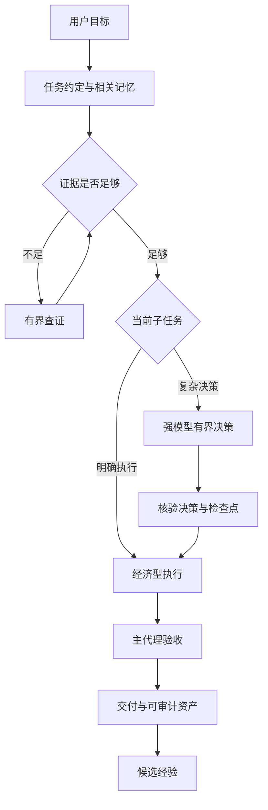

# Agent Cognitive Runtime

**简体中文** · [English](README.en.md)

> 让强模型处理关键判断，让经济型模型完成明确执行，让每次交接都有证据。

为 Codex 提供可迁移的记忆、任务验收与子代理分工。Python 3.11+，本地运行，运行时只使用标准库。

## 解决什么问题

长任务容易丢失已确认的约束；便宜模型遇到难题容易反复尝试；强模型又常把简单工作全部做完。仅增加一段更长的提示词，无法稳定解决这些问题。

这个项目把任务约定、相关记忆、模型分工、验收和失败经验放进一套可检查的流程：复杂判断按需交给强模型，明确执行交给经济型模型，经验先作为候选保存。

**当前是可运行的本地原型，尚未证明能节省固定比例的 token，或让 Luna 达到 Sol 的成功率。** Skill 改善的是组合系统的有效表现，不改变基础模型权重。

## 这是什么

- **一份可安装的 Skill**：告诉 Agent 何时查询记忆、建立验收和交接子任务。
- **一个本地内核**：用 SQLite 保存有来源、版本、到期时间和依赖关系的记忆。
- **一套可替换的分工配置**：模型、职责、推理档位、难度特征与预算分别维护。
- **一份可追溯的研究与评测设计**：把论文依据、工程建议和已实现能力分开。

当前支持 Codex 适配器。模型无关的是职责与协议设计；其他宿主仍需实现对应适配器。

## 一段话安装

将下面这段话交给你的 Codex。它会核对环境、检查改动、安装并验收；模型名称以你的宿主实际提供为准。

```text
请帮我安装并配置 Agent Cognitive Runtime：
https://github.com/Rethymus/agent-cognitive-runtime

1. 把仓库克隆到合适的本地项目目录，先阅读 README.md 和 docs/installation.md。
2. 检查 Python 3.11+ 与当前 Codex 的 Skill、子代理能力。
3. 检查 skill/policies/model-registry.json 中的模型和 effort 是否在我的宿主可用。
   未验证的模型不要猜测，也不要静默降低经济型子代理的 xhigh/max 档位。
4. 先运行安装预览。默认安装 Skill；确认宿主支持后再选择全局入口与原生角色。
   保留我的主模型、现有配置和本地记忆；遇到旧安装先比较差异。
5. 运行本地测试和安装诊断，报告已验证、未验证和需要我处理的事项。
6. 日常更新按仓库维护流程进行，不自动晋升经验或改写 Skill。
```

仓库的安装器不下载依赖、不调用模型，也不改写 `config.toml`。默认安装仅写 Skill；激活全局入口和生成角色是明确选项。[完整安装说明](docs/installation.md)

## 安装 → 使用 → 更新

在克隆后的仓库中运行：

```sh
python -X utf8 scripts/manage.py install
python -X utf8 scripts/manage.py install --apply
python -X utf8 scripts/manage.py doctor
```

第一条预览，第二条安装，第三条检查文件与模型注册表的复核日期。诊断不会运行模型，不表示你的账号一定能调用示例模型。

安装后对 Codex 说：

```text
使用 agent-cognitive-runtime 完成这个任务。先明确验收条件；
将独立、可验证的执行交给经济型子代理，复杂判断按需升级，最后核验结果。
```

首次调用若没有自动发现 Skill，可在新会话中显式使用 `$agent-cognitive-runtime`。更新时先审查仓库变更、运行测试，再重新安装；[维护说明](docs/maintenance.md)提供模型替换和回滚步骤。此项目没有自动联网更新或后台学习服务。

## 工作原理



派发前通过共享账本预约；只有准入成功才调用子代理。子代理不递归派生，主代理核验实际产物和证据。强模型完成决策后，在已验证检查点把执行交回经济型模型。

默认经济型档位为 xhigh，修复可用 max；强模型日常 medium/high，攻坚 xhigh/max。内置模型绑定是带复核日期的研究环境示例，不能直接当作跨账号能力保证。

每个逻辑任务默认最多 4 次子代理新推理轮次，其中强模型 2 次、frontier 1 次、max 1 次，同时在途最多 3 次。失败、取消和后续新推理轮次都计数。[双向路由与预算](docs/routing.md)

## 能力与边界

| 能力 | 当前状态 |
|---|---|
| 本地记忆、来源、版本冲突、TTL、遗忘与依赖失效 | 已实现 |
| 证据特征路由、检查点降级、共享预约与回执 | 已实现本地接口 |
| 子代理调用 | 由宿主工具执行，需满足宿主委派条件 |
| 新模型替换 | 注册表与角色配置分离，需重新核对和评测 |
| 自动切换当前主模型、全局 token 硬封顶 | 未实现 |
| 难度概率校准、模型质量与节省比例证明 | 未完成实证评测 |
| 候选经验自动晋升、独立发布服务 | 关闭／未实现 |

若经济型主代理被完全顺序的难题阻塞，且宿主不允许该场景委派，系统返回交接需求，不声称已经切换主模型。预算账本只约束经过接口的预约；拥有任意文件权限的进程能绕过它。[完整实现状态](docs/implementation-status.md)

## 记忆与数据

User / Project / Episodic / Failure / Procedural / Skill Library / Evaluation 七层记忆，另有 Task 检查点。正常检索只读取相关、未失效的记录，候选经验默认隔离。仅沉淀公开的决策、证据与验收结论，不保存私有思维链。

数据库、安装备份与真实运行回执保存在本机状态目录，更新或回滚代码不恢复已遗忘的内容。不同记忆用途的治理策略独立配置，不能改变宿主权限。[记忆机制](docs/memory.md) · [数据与信任边界](docs/security.md)

## 研究与开发

研究从用户提供的 Fable 附件机制审查出发，结合 Agent Skills、context engineering、ReAct、Reflexion、Self-Refine、Voyager、弱强监督和模型路由研究。原附件身份未被认证，全文不随仓库分发。

[研究导航](docs/research/README.md) · [双向路由研究](docs/research/adaptive-routing.md) · [参考仓库分析](docs/research/reference-repository.md) · [评测设计](docs/evaluation.md)

```sh
python -X utf8 -m unittest discover -s tests -v
python -X utf8 scripts/check_repository.py
```

测试验证程序约束和回滚行为，不是模型能力基准。模型注册表测试固定研究快照日期，并另测过期拒绝；真实使用仍按当前日期检查。CI 在 Linux / Windows、Python 3.11 / 3.12 运行。[贡献说明](CONTRIBUTING.md)

## 目录结构

```text
skill/              可安装的 Skill、内核、策略、接口示例
scripts/            安装、诊断、回滚与仓库检查
tests/              记忆、路由、预算和安装测试
docs/               安装、架构、协议、维护与故障排查
  research/         研究依据、附件迁移记录、参考仓库分析
  design/           尚未全部实现的目标协议与 schema
evals/              任务场景、对照实验和运行记录模板
examples/           目标协议的格式示例
```

## 参考与许可

项目组织与 README 的用户路径参考了 [XiaoDuoYa/codex-with-chatgpt](https://github.com/XiaoDuoYa/codex-with-chatgpt)：先讲问题，提供可交给 Agent 的安装入口，再解释架构、验证和维护。本项目独立实现本地记忆和子代理路由，不包含其浏览器、MCP、OAuth 或隧道实现，也不调用 ChatGPT 网页额度。

非官方社区项目，与 OpenAI 或 Anthropic 无隶属关系。[MIT License](LICENSE) 适用于本仓库原创代码与文档；外部论文、参考项目与原始附件保留各自权利。
