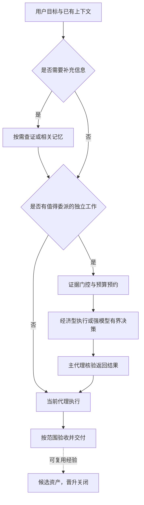

# Agent Cognitive Runtime

**简体中文** · [English](README.en.md)

> 按需使用记忆与子代理，让关键判断和任务交接都有证据。

为 Codex 提供可迁移的记忆、任务验收与子代理分工。Python 3.11+，本地运行，运行时只使用标准库。

## 解决什么问题

长任务容易丢失已确认的约束；便宜模型遇到难题容易反复尝试；强模型又常把简单工作全部做完。仅增加一段更长的提示词，无法稳定解决这些问题。

这个项目把任务约定、相关记忆、模型分工、验收和失败经验放进一套可检查的流程：复杂判断按需交给强模型，值得交接的明确执行交给经济型模型，经验先作为候选保存。当前上下文足够或交接收益不足时，直接完成任务。

**当前是可运行的本地原型，尚未证明能节省固定比例的 token，或让 Luna 达到 Sol 的成功率。** Skill 改善的是组合系统的有效表现，不改变基础模型权重。

## 这是什么

- **一份可安装的 Skill**：告诉 Agent 何时查询记忆、建立验收和交接子任务。
- **一个本地内核**：用 SQLite 保存有来源、版本、到期时间和依赖关系的记忆。
- **一套可替换的分工配置**：模型、职责、推理档位、难度特征与预算分别维护。
- **一份可追溯的研究与评测设计**：把论文依据、工程建议和已实现能力分开。

当前支持 Codex 适配器。模型无关的是职责与协议设计；其他宿主仍需实现对应适配器。

## 一段话安装

将下面这段话交给你的 Codex。它会核对环境、检查改动、安装并验收；模型名称以你的宿主实际提供为准。

```text
请帮我安装并配置 Agent Cognitive Runtime：
https://github.com/Rethymus/agent-cognitive-runtime

1. 把仓库克隆到合适的本地项目目录，先阅读 README.md 和 docs/installation.md。
2. 检查 Python 3.11+ 与当前 Codex 的 Skill、子代理能力。
3. 检查 skill/policies/model-registry.json 中的模型和 effort 是否在我的宿主可用。
   未验证的模型不要猜测，也不要静默降低经济型子代理的 xhigh/max 档位。
4. 先运行安装预览。默认安装 Skill；确认宿主支持后再选择全局入口与原生角色。
   保留我的主模型、现有配置和本地记忆；遇到旧安装先比较差异。
5. 运行本地测试和安装诊断，报告已验证、未验证和需要我处理的事项。
6. 日常更新按仓库维护流程进行，不自动晋升经验或改写 Skill。
```

仓库的安装器不下载依赖、不调用模型，也不改写 `config.toml`。默认安装仅写 Skill；激活全局入口和生成角色是明确选项。[完整安装说明](docs/installation.md)

## 安装 → 使用 → 更新

在克隆后的仓库中运行：

```sh
python -X utf8 scripts/manage.py install
python -X utf8 scripts/manage.py install --apply
python -X utf8 scripts/manage.py doctor
```

第一条预览，第二条安装，第三条检查文件与模型注册表的复核日期。诊断不会运行模型，不表示你的账号一定能调用示例模型。

安装后对 Codex 说：

```text
使用 agent-cognitive-runtime 完成这个任务。按需使用相关记忆；
有明确收益时委派独立执行，复杂判断按需升级，按任务范围核验结果。
```

首次调用若没有自动发现 Skill，可在新会话中显式使用 `$agent-cognitive-runtime`。更新时先审查仓库变更、运行测试，再重新安装；[维护说明](docs/maintenance.md)提供模型替换和回滚步骤。此项目没有自动联网更新或后台学习服务。

## 工作原理



派发前通过共享账本预约；只有准入成功才调用子代理。子代理不递归派生，主代理核验实际产物和证据。强模型完成决策后，仅在交接仍有收益时经已验证检查点交回经济型；短小的剩余工作可直接完成。

默认经济型档位为 xhigh，修复可用 max；强模型日常 medium/high，攻坚 xhigh/max。内置模型绑定是带复核日期的研究环境示例，不能直接当作跨账号能力保证。

每个逻辑任务默认最多 4 次子代理新推理轮次，其中强模型 2 次、frontier 1 次、max 1 次，同时在途最多 3 次。失败、取消和后续新推理轮次都计数。[双向路由与预算](docs/routing.md)

## 能力与边界

| 能力 | 当前状态 |
|---|---|
| 本地记忆、来源、版本冲突、TTL、遗忘与依赖失效 | 已实现 |
| 证据特征路由、检查点降级、共享预约与回执 | 已实现本地接口 |
| 子代理调用 | 由宿主工具执行，需满足宿主委派条件 |
| 新模型替换 | 注册表与角色配置分离，需重新核对和评测 |
| 自动切换当前主模型、全局 token 硬封顶 | 未实现 |
| 难度概率校准、模型质量与节省比例证明 | 未完成实证评测 |
| 候选经验自动晋升、独立发布服务 | 关闭／未实现 |

若经济型主代理被完全顺序的难题阻塞，且宿主不允许该场景委派，系统返回交接需求，不声称已经切换主模型。预算账本只约束经过接口的预约；拥有任意文件权限的进程能绕过它。[完整实现状态](docs/implementation-status.md)

## 记忆与数据

User / Project / Episodic / Failure / Procedural / Skill Library / Evaluation 七层记忆，另有 Task 检查点。正常检索只读取相关、未失效的记录，候选经验默认隔离。仅沉淀公开的决策、证据与验收结论，不保存私有思维链。

数据库、安装备份与真实运行回执保存在本机状态目录，更新或回滚代码不恢复已遗忘的内容。不同记忆用途的治理策略独立配置，不能改变宿主权限。[记忆机制](docs/memory.md) · [数据与信任边界](docs/security.md)

## 论文与研究依据

下表把论文或研究报告提供的机制线索，与本项目可迁移的设计方向及边界并列。表中内容是来源报告或设计推断，不是本项目实测；实现能力、成本与模型质量必须通过本仓库实验验证。

| 研究方向 | 直接论文／研究链接 | 项目迁移与边界 |
|---|---|---|
| ReAct：推理与行动交错 | [ReAct](https://arxiv.org/abs/2210.03629) | 启发“推理—工具—观察”的工作循环；当前代码只验证协议与工具回执，不宣称论文效果。 |
| Reflexion：利用反馈形成可复用反思 | [Reflexion](https://arxiv.org/abs/2303.11366) | 启发把失败回执和反思保存为候选证据；自动晋升仍关闭，需独立验收。 |
| Self-Refine：反馈驱动的迭代改写 | [Self-Refine](https://arxiv.org/abs/2303.17651) | 支持把“生成—评审—修订”拆成可验收步骤；自评不等于正确，需确定性测试或校准评审。 |
| Voyager：技能库与课程式积累 | [Voyager](https://arxiv.org/abs/2305.16291) | 启发 Skill Library 和程序性资产；迁移到 Codex 工具与项目需任务分离、负对照。 |
| 程序性记忆与工作流记忆 | [Agent Workflow Memory](https://arxiv.org/abs/2409.07429) · [Managing Procedural Memory](https://arxiv.org/html/2606.23127v1) | 以 workflow、subtask、function 等粒度组织经验；作用域、版本和不适用时拒绝复用仍需项目验证。 |
| 弱强监督（weak-to-strong） | [Weak-to-Strong Generalization](https://arxiv.org/abs/2312.09390) | 研究弱监督下强学习者的训练；与本项目“强教师指导经济型执行”的方向不同，不作为 Skill 更新模型权重的证据。 |
| Test-time compute 与额外推理 | [Scaling LLM Test-Time Compute](https://arxiv.org/abs/2408.03314) · [Inverse Scaling](https://alignment.anthropic.com/2025/inverse-scaling/) · [When More Thinking Hurts](https://arxiv.org/abs/2604.10739) | 支持把模型与 effort 分开配对、把路由成本计入；论文任务与模型边界不能换算为 Codex effort 或节省比例。 |
| RouteLLM：基于偏好数据的模型路由 | [RouteLLM](https://arxiv.org/abs/2406.18665) | 启发模型选择的评测对照；当前路由仍是规则与证据门控，不宣称偏好路由收益。 |
| EvoAgentBench：能力迁移与自我演化评测 | [EvoAgentBench](https://arxiv.org/html/2607.05202v1) | 支持在同类新实例、工具变化和负对照中测试 Skill 迁移；Anchor 或能力标签不是部署路由证明。 |
| AMD（Agent Memory Distillation） | [Agent Memory Distillation](https://arxiv.org/html/2608.07169v1) | 启发教师工作流、子任务、函数级资产；静态离线记忆和有限工具任务不足以证明本项目在线效果。 |
| MemGym 与 StreamMemBench：长程和流式记忆 | [MemGym](https://arxiv.org/html/2605.20833v1) · [StreamMemBench](https://arxiv.org/html/2606.14571v2) | 将记忆评测拆为保留、首次使用、反馈吸收和后续复用；合成任务与个人流设置不能直接外推代码任务。 |
| MemSyco-Bench：记忆迎合与误用 | [MemSyco-Bench](https://arxiv.org/html/2607.01071v2) | 要测相关但错误、过期或跨项目记忆诱发的错误；合成对话不提供真实发生率。 |
| 评估器可靠性与自我纠错 | [LLMs Cannot Self-Correct Reasoning](https://arxiv.org/abs/2310.01798) · [Key Condition Verification](https://arxiv.org/abs/2405.14092) · [Demystifying evals](https://www.anthropic.com/engineering/demystifying-evals-for-ai-agents) · [LLM-as-a-Judge](https://arxiv.org/html/2609.02246v1) · [Self-Preference Evaluations](https://arxiv.org/html/2601.22548v4) | 将 judge 当作待校准证据，确定性门槛优先；来源报告不证明本项目评估器已经可靠。 |
| 评测完整性、奖励篡改与环境噪声 | [Infrastructure noise](https://www.anthropic.com/engineering/infrastructure-noise) · [Eval awareness](https://www.anthropic.com/engineering/eval-awareness-browsecomp) · [Hack-Verifiable Environments](https://arxiv.org/html/2605.20744v1) | 隔离答案、评分器和留出集并记录环境与成本；现有本地实现尚未形成独立执行边界。 |

规范与工程文档（不是论文）：[Agent Skills Specification](https://agentskills.io/specification) · [Effective context engineering for AI agents](https://www.anthropic.com/engineering/effective-context-engineering-for-ai-agents)。完整来源、读取范围与局限见 [sources.json](docs/research/sources.json)，主张与实验的证据映射见 [evidence-map.json](docs/research/evidence-map.json)。

## 根据新模型与资料继续迭代

提供新的模型卡、论文、工具文档、语料、执行示例或评测记录后，维护 Agent 可使用 [资料迭代入口](docs/material-evolution.md) 建立版本化资料包。工具已经支持结构与来源引用检查、证据缺口提示、候选文件与基线哈希、包内派生影响分析，以及语料跨划分的重复指纹／分组检测。

```sh
python -X utf8 scripts/materials.py plan examples/material-bundles/teacher-assets/bundle.json
python -X utf8 scripts/materials.py plan examples/material-bundles/future-model/bundle.json
```

第一份示例演示教师资产实验准备，第二份明确保留新模型的待验证项。工具不执行材料中的指令、不自动改配置，也不把元数据完整当作模型能力证明。[字段 schema](schemas/material-bundle.schema.json) · [完整操作与给 Agent 的更新指令](docs/material-evolution.md)

资料生命周期进一步参考 [Model Cards](https://arxiv.org/abs/1810.03993)、[Datasheets for Datasets](https://arxiv.org/abs/1803.09010) 和 [W3C PROV](https://www.w3.org/TR/prov-overview/)。它们分别帮助记录模型适用范围、语料组成与维护、来源派生关系；已有论文仍保留在上述依据表和来源目录中。

## 规则也随模型迭代

0.3.3 将 Skill 精简为记忆、委派和维护三个按需入口。固定阶段是可用环节，不要求每项任务走完；授权、候选隔离、预算、核验和回滚边界继续保留。全局激活块也检测本地修改，升级前需合并冲突。

[规则复核与消融设计](docs/instruction-evolution.md)记录了本轮具体决策、反证条件和 H09 对照协议；[可检查资料包](examples/material-bundles/instruction-review/bundle.json)供后续 Agent 继续更新。依据包括 [OpenAI 模型指导](https://developers.openai.com/api/docs/guides/latest-model)和 [Eric Provencher 的实践文章](https://developers.openai.com/blog/rethinking-skills-and-prompts-for-gpt-6-astra)，它们属于工程指导，不替代上面的论文证据。文件精简不等于已经证明质量或费用收益。

## 研究与开发

研究从用户提供的 Fable 附件机制审查出发，结合 Agent Skills、context engineering、ReAct、Reflexion、Self-Refine、Voyager、弱强监督和模型路由研究。原附件身份未被认证，全文不随仓库分发。

[研究导航](docs/research/README.md) · [9 月深度证据审查](docs/research/evidence-review-2026-09.md) · [双向路由研究](docs/research/adaptive-routing.md) · [评测设计](docs/evaluation.md)

研究记录将原论文结论、适用限制和项目实测分开。新增的 [证据映射](docs/research/evidence-map.json) 与 [持续开发流程](docs/research/development-program.md) 把 11 条主张关联到 9 组待运行实验；尚不宣称 Luna+Harness 已达到 Sol 的质量或节省了多少额度。

```sh
python -X utf8 -m unittest discover -s tests -v
python -X utf8 scripts/check_repository.py
```

测试验证程序约束和回滚行为，不是模型能力基准。模型注册表测试固定研究快照日期，并另测过期拒绝；真实使用仍按当前日期检查。CI 在 Linux / Windows、Python 3.11 / 3.12 运行。[贡献说明](CONTRIBUTING.md)

## 目录结构

```text
skill/              可安装的 Skill、内核、策略、接口示例
scripts/            安装、诊断、回滚、资料迭代与仓库检查
schemas/            已实现资料包与语料清单的字段契约
tests/              记忆、路由、预算和安装测试
docs/               安装、架构、协议、维护与故障排查
  research/         研究依据、附件迁移记录与证据审查
  design/           尚未全部实现的目标协议与 schema
evals/              任务场景、对照实验和运行记录模板
examples/           目标协议的格式示例
```

## 许可

非官方社区项目，与 OpenAI 或 Anthropic 无隶属关系。[MIT License](LICENSE) 适用于本仓库原创代码与文档；外部论文、参考项目与原始附件保留各自权利。
