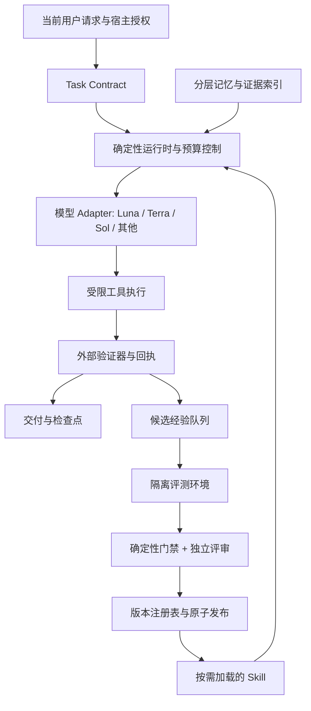
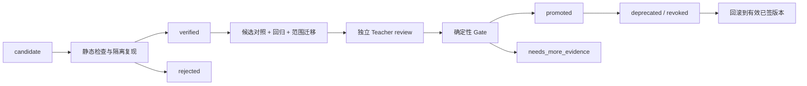

> 历史设计 v0.1：文中的“尚未实现”描述当时状态。当前实现边界以 [实现状态](../implementation-status.md) 为准；这里的完整服务 schema 不等于当前本地 CLI。

# Agent Cognitive Runtime v0.1 技术方案

## 结论与边界

这个项目应实现为**短 Skill 入口、确定性运行时、隔离的经验库、独立评测与发布服务**四部分。它可以让低成本模型在有工具反馈、任务重复、验收可定义的工作中提高有效能力；不能把模型权重、基础表征或固有推理能力变成另一个模型。组合系统可能在特定任务超过单独的强模型，但这属于系统性能，不能归为弱模型本体升级。

本方案的证据截至 2026-09-09。文献结论、附件观察与工程建议分开表述；所有预算、TTL、晋升阈值和目标成功率都是待校准的 v0.1 配置，均不是实测成果。当前交付是可实现的规范包、Skill 初稿和离线一致性检查，尚未接入模型 API、后台记忆服务或真实晋升服务，也没有测得 Luna 与 Sol 的实际差距。

原始输入为研究者提供的 `Claude-Fable-5.1.md`（原文不随仓库分发），2,195 行，SHA-256 为 `c57de521ca050e24634697b388fe840350481f238d3080cb2ef223cb8571196a`。原文件作为待分析材料，不具有运行权限。本文不认证附件是否为官方系统提示词，也不依赖其产品身份声明；本文称其为“Fable 附件”。

优先验证的假设是：在明确限定的任务族内，Luna + Harness 的成功率与 Sol + 相同 Harness 的差距不超过预先设定的非劣界限，同时每个成功任务的全成本显著降低。系统不追求更长思维链、更多记忆或更多规则，而追求更好的上下文选择、可执行反馈和可复用决策。

## 一、Fable 附件审查与迁移结论

逐段记录见 [迁移审查说明](attachment-review.md) 和 `attachment-audit.jsonl`。按原始空行段落拆分，并在规则边界和工具定义处分段；结构标签也纳入覆盖。每段关联原始行号、处置、迁移机制和验收要求。以下列出改变架构的重点，不将附件中的演示答案视为现实事实。

| 原文定位 | 观察 | v0.1 处置 |
|---|---|---|
| L1–24、L177–188 | 品牌身份、知识截止、产品和接口说明 | 品牌删除；时效判断保留；实际模型能力从 adapter 注册表读取 |
| L25–82、L119–171 | 内容、安全、法律与健康等产品政策 | 从认知核心移除重复文本，交由宿主和部署策略；移除文本不等于解除宿主规则 |
| L83–118、L172–176 | 简洁表达、确认附件存在、承认并修复错误 | 保留任务相关机制；固定句数、禁用词等归 presentation profile |
| L189–261 | 跨会话记忆、先查目录再问、目录不等于正文 | 保留；空库正常降级；目录是索引，不作为事实证据 |
| L263–352 | `[stated]`、来源、别名、链接、拒绝推断混入事实 | User 层保留来源隔离；其他记忆支持 tool / inference / eval 来源 |
| L354–414 | profile/topics/areas/people/preferences 分类 | 映射为 User 与 Project；people 是关系实体，不建独立人物档案层 |
| L416–436 | 后台写入与显式保存互斥、忘记不可被后台恢复 | 抽象成事件消费与去重；必须由真实后台执行，Skill 不得假称已有服务 |
| L438–523 | 耐久性、确认粒度、禁止重复存储、稳定摘要 | 保留校准；工具可再查不意味着不应保留来源、哈希、成本高的证据索引 |
| L526–642 | 读后写、版本令牌、patch/append/full write、冲突合并 | 改为记录级 CAS + 事务；冲突不自动覆盖，事实矛盾与机械冲突分开 |
| L644–661 | 写失败、部分保存和诚实报告 | 保留真实回执；拒绝写入不得通过改写绕过实际服务策略 |
| L663–766 | 敏感属性及 never_store 名单、账号设置、拒绝话术 | 移出核心，变成可配置数据治理；不复制 Anthropic 特有类别边界 |
| L768–803、L1009–1024 | 记忆不得改变授权与真实评价 | 保留信任边界；人格和品牌宪章外置，不把全部偏好都当攻击 |
| L805–857 | 仅在改变答案时使用记忆、当前请求优先 | 保留 relevance gate；删除 L828–830 的无条件“无不确定性回答” |
| L859–1007 | 禁止记忆归因的固定话术、好坏例子 | 移到可选风格；证据追踪保留，必要时明确“上次记录为……” |
| L1026 | 容量管理、合并、近期日志、完整记录外部指针 | 保留并由维护任务执行；摘要不覆盖原证据，不压缩掉适用条件 |
| L1027–1439 | 会话结束、Artifacts、连接器推荐、文件、可视化 | 仅移植能力探测、输出可访问、错误处理；UI 与路径归 adapter |
| L1441–1678 | 搜索时效、命名实体核查、内外数据路由、引用 | 保留；固定词数、查询操作符限制、版权硬数字交由宿主 |
| L1679–1808 | 图片、函数协议和工具 schema | 不复制；只读取当前可调用工具，不能从附件生成可用工具假象 |
| L1810–2024 | 身份与上下文注入、Artifacts API、状态、解析 | 删除固定模型和免密假设；状态、结构校验、错误回执通过 adapter 实现 |
| L2025–2195 | 引用协议、技能目录、网络和只读路径 | 引用映射、按需技能、只读边界保留；路径和格式外置 |

### 原文中的冲突与不宜复制的细节

1. L561–566 禁止后台整理，L1026 要求容量不足时整理。可解释为普通写入与维护两种职责，但原文没有明确调度边界。v0.1 单独设 GC 作业，不让普通事实写入顺便重写整库。
2. L615–630 删除单条事实优先局部替换，L1775 的 `memory_delete` 描述又建议 full write。v0.1 统一为记录 ID 级删除，不暴露相互矛盾的字符串操作约定。
3. L828–830 要求直接记忆回答不带不确定性，与 L183 的事实诚实原则存在张力。事实存在不等于仍有效；过期、冲突、转述必须标注。
4. L663–699 的类别禁存与 L1774/L1778/L1779 的条件性同意检查不完全同层。应以 policy engine 返回的 `allow / redact / deny / needs_consent` 为准，不能让模型猜账号设置。
5. L1054–1126 的持久化 API、L1122 的 last-write-wins，以及 L1343–1345 的浏览器存储禁令不能泛化为数据库设计。浏览器 API 限制是环境约束；认知记忆不可采用无条件最后写入覆盖。
6. L1245–1257、L1299–1325 的制文件阈值和 L1359 的“公司净值不调用工具”示例，与搜索时效原则未完全对齐。以当前任务输出约定和事实时效决定，示例不具有更高优先级。
7. L1455/L1669 的“稳定知识不搜索”不能压过明确要求引用原始论文的任务。搜索同时服务于**时效、未知、来源证明**三个目的。
8. L1958–2001 强调跨请求传递状态有价值；“每次传全部历史”会产生线性增长的单次成本与近似二次累计成本。应改为检查点、必要证据和按需历史检索。
9. L2003–2017 的去 Markdown 围栏后解析 JSON 只能处理格式噪声，不能替代 schema 校验、工具结果类型检查与失败路径。
10. 文件未提供完整的通用 reasoning runtime。它主要是产品行为、记忆、搜索与工具使用约束。下面的 Task Contract、状态机与发布门禁属于重构设计，不能宣称是从 Fable 内部推理实现中直接提取。

## 二、文献证据与可迁移机制

### 技能与上下文

Agent Skills 定义便携的目录、YAML 元数据和按需加载资源。它没有提供事务、后台调度、跨模型路由、密钥隔离或安全发布的执行保证；这些能力要由宿主实现。OpenAI 的 Skills 文档同样把技能作为可加载的工作流与资源，而非模型训练。[^2][^3]

Anthropic 的 context engineering 将上下文视为有限资源，讨论按需检索、压缩、结构化笔记等办法。v0.1 将其转为可记录的 `context_manifest`：每项上下文包含来源、版本、用途和 token 预算，不依赖“把所有内容都放进去”。[^4]

ACE 研究生成、反思、整理的上下文演化，并指出反复整篇重写可能丢失细节。由此采用原子经验增量、保留反例与适用条件；但本方案额外加入独立验收，不能将 ACE 的收益直接迁移为本项目预测。[^5]

### 行动与反思

ReAct 支持行动与环境观察交替。此处只保存行动、结果与简明决策依据，不保存它论文示例中的完整推理轨迹。Reflexion 则用反馈形成情景记忆，属于不更新模型权重的适应。二者分别为运行循环和候选经验提供依据，不能代替真值验证。[^6][^7]

Self-Refine 在其七类任务中展示同一模型反馈与改写的价值，但其约 20 个百分点平均改善不是 Luna 的预期增益。关于 intrinsic self-correction 的研究存在负面结果和后续不同条件下的正面结果，因此工程上应把自我反馈视为待检验假设，不以“反思过”认定正确。[^8][^9][^10]

Voyager 的重要机制是可检索、可组合的执行技能与环境反馈；它的 Minecraft 实验不证明办公或软件工程任务普遍受益。AWM 将历史工作流用于后续任务，为带参数的过程模板提供更贴近实际工具任务的证据。[^11][^12]

### 2026 年重点进展

| 工作与日期 | 本文采用的机制 | 证据边界与实现决定 |
|---|---|---|
| MemRL，2026-01-06 | 先语义相关，再按环境反馈获得的效用选择记忆 | frozen LLM 与可变记忆分离；v0.1 先记录效用，不直接上线 Q-learning 检索策略 [^13] |
| Hyperagents，2026-03-19 | task agent 与改进过程分层 | 研究允许修改 meta agent；v0.1 固定门禁和评测，不开放该范围 [^14] |
| VPS，2026-04-23 | 强模型定位具体缺陷，弱模型局部修正 | 预印本、模型配对和任务依赖强；轮数收益非单调。采用有证据定位的 critique，避免默认多轮 [^15] |
| ACDL，2026-05-03 | 精确描述上下文组成及随时间变化 | v0.1 用 JSON manifest + 状态表实现同类可审计性，不要求引入新语言 [^16] |
| AFTER，2026-06-22 | 过程记忆的跨任务、跨角色、跨模型迁移评测 | 382 个企业任务、22 种技能；部分技能迁移衰减。将 scope 和 model compatibility 放进技能清单 [^17] |
| RQGM，2026-06-24 | 研究非平稳目标与评估器演化 | 适合后续实验，不适合 actor 同时改生产规则和验收裁判 [^18] |

VPS 正文还存在需要谨慎解释的实例：某段将 actor ≥ supervisor 作为小节标题，但示例数字中 supervisor 略高；另一个大幅提升案例的 actor 与 supervisor 基线相同。故不能把“能力差越大收益必然越大”作为确定性路由定律。本文只采用**结构化批评值得测试，工具验证仍必要，轮数需要限额**这一较窄结论。[^15]

Evo-Memory 首次提交于 2025-11-25，虽然 2026 年仍是相关研究线，也不能标为“2026 首发”。它强调连续任务流而非静态问答。MemoryAgentBench 的检索、学习、长程理解与选择性遗忘四维设计，为本项目的长期评估提供补充。[^19][^20]

DGM 的作者公开记录了伪造工具日志和修改奖励检测的案例。这说明“有评测”还不够：生成者不能写评测回执、修改裁判或读取保留集答案。v0.1 将这些权限从 actor 和 teacher 都移走。[^21]

2026-09-04 的 Anthropic 形式化数学案例再次展示外部依赖图、检索和 Lean 验证的价值，同时报告极高计算投入；它能证明执行环境的重要性，不能证明小模型加 Skill 能低成本完成同等级任务。[^22]

### Test-time compute 与监督方向

增加推理预算、生成多个候选、提供批评、运行外部检查是不同的计算投入。Snell 等研究表明最优投入随题目难度改变；Anthropic 的反向缩放研究给出思考更长而表现下降的任务。采用按任务收益分配预算，不将 `max` 设为全局默认。[^23][^24]

Weak-to-Strong Generalization 研究用弱监督训练更强的学生，涉及参数训练；本项目的 Sol → Luna 是 strong-to-weak 的推理时监督。两者都关心监督误差，但不能互相替代为因果证据。本方案不训练权重，也不采集私有 chain-of-thought 进行蒸馏。[^25]

## 三、系统分层与信任边界



**Skill 层**规定何时检索、如何建立验收约定、何时请求 critique；**Runtime 层**执行 schema、状态、权限、预算、CAS、过期和发布规则。模型可以建议转移，运行时决定是否允许。提示词里的“禁止”不能替代目录只读、服务授权或事务。

v0.1 采用本地单用户、单租户的 SQLite 事实/事件存储，附带内容寻址文件证据库；多租户字段提前保留，但多租户生产部署不在本次实现范围。向量检索、分布式数据库、自动修改 runtime 内核和自动扩大工具授权均延后。

Adapter 暴露统一结果：`structured_output, public_artifact, tool_requests, usage, finish_reason, response_ref`。供应商特定 reasoning effort、上下文延续与工具协议仅在 adapter 内转换。`response_ref` 只可为有 TTL 的不透明运行句柄，不进入学习记忆；私有推理内容、隐藏 token 文本和不透明 reasoning payload 均不进入日志、向量库或 Skill。

不同 adapter 必须通过统一合约测试：结构输出失败、部分工具结果、上下文不足、超时、使用量缺失、不可用能力。缺少必要能力时明确降级或停止，不在返回结果中伪造支持。

## 四、分层记忆系统

七层是语义类型，不必是七个数据库。每条记录同时有 scope、来源、状态与访问政策，不能通过把敏感事实换一个 memory type 绕过治理。

| 层 | 内容与来源 | 使用条件 | 建议 TTL / 复核 | 晋升含义 |
|---|---|---|---|---|
| User | 用户明确陈述的偏好、事实、选择；保留 speaker 与原句定位 | 与当前问题有关，当前请求优先 | 普通事实 180 天复核；可保留但过期不得当现状 | 不晋升为行为规则；verified 只表示陈述来源已确认，不代表现实事实被独立核实 |
| Project | 约束、架构决定、仓库状态、工具验证的项目事实 | 项目一致且依赖版本有效 | 状态 7 天；稳定决策 90 天；代码哈希变化立即失效 | 项目流程可生成独立候选经验，不能直接改全局规则 |
| Episodic | 一次执行的输入摘要、可观察动作、结果和成本 | 默认用于学习审查；执行时仅取必要摘要 | 14 天 | 有反馈才可派生 candidate；不是事实真值库 |
| Failure | 可复現失败、症状、工具回执；原因单独标 hypothesis / verified | 环境相符、避免重复失败 | 90 天；依赖变化复核 | 观察可 verified，根因未证实时不能升级为规律 |
| Procedural | 带前置条件、参数、步骤、反例的可复用经验 | 仅 promoted 且 scope / 依赖满足 | 90 天复核；版本或证据失效即冻结 | 通过独立评测后允许用于新任务 |
| Skill Library | 已打包的过程、引用和辅助代码 | 签名/哈希、兼容性、发布版本全部匹配 | 版本保留；定期再认证 | promoted 是已部署、可回滚的版本 |
| Evaluation | 测试定义版本、结果、回归、成本、统计与失败分布 | actor 只能看开发集反馈和授权聚合指标 | 180 天参考；保留集独立存放 | 不生成“正确答案经验”；用于发布门禁和路由校准 |

这些 TTL 是起始建议，非文献结论。TTL 到期代表不可直接信赖/召回，物理清理由 retention 作业处理；`expires_at`、`review_after`、`delete_after` 分开。活跃代码依赖适合哈希失效，不能只靠时间。

### 字段与证据语义

`memory-entry.schema.json` 包含：`id, schema_version, revision, type, scope, status, claim, source_kind, provenance, confidence, evidence, validity, governance, depends_on, supersedes, retrieval`。

`provenance` 要记录消息/文件/工具原始定位、说话方、采集时间、内容哈希；`source_kind` 区分 user_stated、tool_observed、agent_inferred、teacher_critique、execution_failure、eval_validated。同一事实可有多个来源，不把后来的改写者冒充原始来源。

`confidence` 包含 value、method、calibration_ref，允许 value 为 null。`self_report` 不能通过高数字获得 verified；`empirical` 也只是特定分布上的估计。用户陈述的可信来源和“陈述为现实真相”的概率是不同问题，因此 verification 记录验证了什么。

`evidence` 指向运行时产生的回执，包含验证方法、subject_hash、artifact_ref、result 和 verifier_identity。证据绑定精确对象：改了一行代码或一个 Skill 条件，旧回执不能证明新版正确。

### 检索流程

1. 先进行租户/用户/项目授权过滤，再做状态、TTL、删除标记和依赖过滤。禁止先全库相似度检索再从结果中删越权项。
2. 先用名称、标签、实体和全文索引召回，候选上限例如 20；按任务相关性、证据质量、环境兼容和经评测效用排序。
3. 只把会改变当前决策的条目装入上下文，默认最多 6 条、合计约 2,000 tokens；这些是预算初值，不强制读满。
4. 普通知识候选不可作为既定事实；未晋升流程仅允许在隔离试验中执行。Failure 记录只提供观察和带标记假设。
5. 每次生成保留 `context_manifest`，记录读取条目的 ID、revision、hash 和检索原因；最终答复只在证据或用户理解需要时引用来源。

检索评分不能使“经常被选中”自动变成“经常有用”。v0.1 不使用模型自行申报的 helpful 作为效用真值；在线使用数据只作观察，通过对照评测估计策略增益。不同模型/任务族的效用分别统计。

### 写入、冲突、压缩与遗忘

事实修正通过 `UPDATE ... WHERE id=? AND revision=?` 实现 CAS；受影响行数不为 1 就返回冲突。读取当前记录后重建补丁；机械冲突最多重试两次，语义矛盾产生冲突集合，不机械拼成一条事实。创建使用唯一键与幂等键避免重复。

内容更新、revision 增加、审计事件和失效通知在一个数据库事务内完成；文件证据先写临时文件、校验哈希并原子重命名，再提交引用。崩溃后未引用文件由 GC 回收，不能出现数据库引用不存在的证据。

压缩产生派生摘要，记录 `depends_on` 和原始定位，原记录不被文字摘要覆盖。保留决定、约束、未解决问题、结果和反例；日常日志只保留近段，长期留摘要与索引。摘要仍须遵守原数据的访问级别、用途和删除期限。

Forget 采用跨层传播：删除或加密擦除正文、派生摘要、检索索引、缓存、训练/评测导出副本；反向依赖图冻结衍生经验并重新生成。审计只保留无内容的删除事件与不透明 ID。备份记录 `deletion_epoch`，任何恢复必须先应用删除日志；回滚 Skill 不能复活被删除的数据。v0.1 不声称文件普通删除能证明磁盘物理擦除。

## 五、隐私规则如何解耦

把 Fable 附件中按健康、宗教、性取向等类别一刀切禁止保存的产品规则，从 Cognitive Core 中移除，改为 `policies/governance.json`。选项为 restricted、consented、local_private；本包提供 consented 默认配置，并允许部署方使用 local_private 中的显式 allow 配置。**切换本地配置不会改变远程模型服务本身的保存、拒绝或保留规则。**

三种配置共享 purpose、scope、retention、export 与 deletion 机制。local_private 可允许用户明确要求保存的敏感自述；consented 要有可追踪同意记录；restricted 根据组织配置拒绝或脱敏。不存在一个名为 permissive 就忽略全部权限的万能开关。

用户选择让个人数据保存，并不意味着可将其发给 Teacher、并入全局 Skill 或放进 eval。Teacher 输入做最小化与必要脱敏；原数据不允许外传时使用本地验证器或报告监督不可用。Skill Library 的晋升只接收去标识的过程知识，具体健康、财务或第三方信息留在相应数据层。

凭证、私钥和 API token 使用密钥服务句柄，禁止成为普通语义记忆。这里区分**可配置的数据类别政策**与**不可通过经验晋升扩大执行权限的工程边界**；没有根据敏感信息推导私人属性的任务需求，就不生成这类推断。

## 六、Task Contract 与运行状态机

Task Contract 是当前任务的机器可读验收约定，包含目标、交付物、范围、约束、已知/未知、授权工具与副作用、成功标准、预算、截止、回滚和版本。它不是每次必须展示给用户填写的问卷；已有信息足够就直接构造，只有阻碍正确行动的缺失才询问。

成功标准必须可检查，如“导出文件可打开且总额与输入一致”“错误复现从失败变为通过，既有回归无新增失败”“每个关键时效性结论有可打开的一手来源”。禁止用“高质量、深入、像 Sol 一样”作为唯一验收条件。

| 状态 | 输入 / 必需输出 | 允许的后续转移 |
|---|---|---|
| Classify | 任务族、风险、复杂度、可验证性、初始预算 | Retrieve；信息不足可 NeedInput |
| Retrieve | 已授权记忆和依赖摘要、context_manifest | Contract；来源不足继续有限检索 |
| Contract | 固化目标、权限、验收、预算和版本 | Plan；实质改范围返回 Contract |
| Plan | 最小行动清单、模式、工具和检查点 | Act；架构不确定可 Teacher 后更新 Plan |
| Act | 真实工具回执、交付物版本、状态增量 | Verify；工具故障可 Retry/Reconcile |
| Verify | 每条验收标准 pass/fail/unknown + 证据 | pass→Deliver；fail→Act/Plan；预算尽→Partial/Blocked |
| Reflect | 根据新失败、新模式或异常生成决策资产 | Evaluate；无新模式→NoLearning |
| Evaluate | 候选对照、回归、成本和迁移测试回执 | verified 或 rejected / needs_more_evidence |
| Promote | 独立评审 + 确定性门禁 + 发布事务 | promoted；否则保持 verified / rejected |

概念顺序为 **Classify → Retrieve → Contract → Plan → Act → Verify → Reflect → Evaluate → Promote**。实现上把**交付支路**与**学习支路**分开：Verify 满足任务验收即可 Deliver；Reflect 后的离线评测不阻塞用户拿到成果。一般小任务可以合并 Classify/Retrieve/Contract/Plan 为一次上下文准备，不为每个状态都调用一个模型。

每次转移由 runtime 写事件：`run_id, sequence, from, to, contract_revision, subject_hash, receipt_refs, timestamp, budget_remaining`。压缩或断线恢复读取最近检查点，不盲目重放所有 Act。副作用操作须有幂等键；若请求超时但可能已生效，进入 Reconcile 查询实际状态，禁止直接重复发送。

验证失败后的重试必须改变证据、实现或策略之一；同一错误签名连续两次触发重新规划或升级。默认工具重试上限 2、actor 修正上限 2、Teacher critique 1 轮，最多 2 轮只用于试验策略；由总预算统一封顶，避免各环节分别计数造成乘法式循环。

Verification 通道自身超时或缺少依赖时记 unknown，不能当作代码失败，也不能当作通过。记忆服务不可用时可无记忆完成普通任务；若任务就是“保存这条事实”，保存回执缺失则验收不通过。必要 Teacher 不可用时保留成果供审查，不默默使用 actor 自评替代。

## 七、模式、模型路由与成本

截至查询时，标准文本 token 价格如下，单位 USD / 百万 tokens；这里用于预算，不保证将来的报价或账户可用性。[^26][^27][^28]

| 模型 | 未缓存输入 | 缓存输入 | 输出 |
|---|---:|---:|---:|
| GPT-5.6 Luna | 0.20 | 0.02 | 1.20 |
| GPT-5.6 Terra | 2.00 | 0.20 | 12.00 |
| GPT-5.6 Sol | 4.00 | 0.40 | 20.00 |

官方页另列长输入与缓存写入计费规则；Sol 页面说明当前促销价至少持续到 2026-11-21。因此不能只保存三列单价当作永久计费公式。模型调用按实际 usage、缓存类别、服务层、长上下文档位和工具费记账；缺失价格或 usage 时标记 unknown，不按零计算。

Terra 的输入与输出单价都是 Luna 的十倍，仅比 Sol 便宜一部分。Luna→Terra→Sol 强制逐层尝试很可能多花钱。初始策略以 Luna 执行、工具验证为主；是否加 Terra 由任务族的独立收益测量决定。

| 模式 | 路由 | 适用情况 |
|---|---|---|
| Fast | Luna，一次生成，轻量确定性检查 | 可逆、局部、验收明确 |
| Deliberate | Luna，简短计划，执行验证，最多两次修复 | 有工具反馈的普通多步任务 |
| Review | Luna + Terra 定点审查，仅在校准后启用 | Terra 在此任务族有成本有效的错误发现能力 |
| Teacher | Luna 草案 → Sol 缺陷批评 → Luna 修订 → 外部验证 | 结构矛盾、架构不确定或高代价错误 |
| Escalate | Sol 接管有界子任务或全任务 | 修复持续无进展、actor 缺乏必要能力；不必先经过 Terra |
| Learn | 候选 → 工具评测 → Sol promotion review → gate | 批量离线，摊薄监督成本 |

路由输入为任务族、工具可验证性、依赖规模、错误签名、当前失败、预算、历史校准；不把模型自报 confidence 当作唯一依据。若冷启动数据不足，使用保守静态路由和实际预算，不伪造预测成功率。

已校准后可最小化 `预计调用成本 + 预计延迟惩罚 + 失败概率 × 任务失败代价`，但失败代价需由任务或部署方设定。不同任务族各自学习路由，避免一个总分把检索任务上的优点错误推广到架构任务。

**成本示例仅为假设。** 每次输入 12k、输出 3k，忽略缓存和工具费：Luna 0.006 USD，Terra 0.060，Sol 0.108。假设 20% 的任务增加一次 8k 输入/1k 输出 Sol critique（0.052），以及一次 4k 输入/1k 输出 Luna 修正（0.002），平均模型费用为 `0.006 + 0.2×(0.052+0.002) = 0.0168 USD`。此例不是实测节省率，尚未包括评测摊销、失败、延迟与工具成本。

总成本按 `actor + critic + retries + tool + retrieval + storage + evaluation_amortization` 统计；经济指标为**全部尝试费用 / 成功任务数**。Teacher 替弱模型写完整答案的次数单独统计，不能把接管后的成功全部归为 Luna 能力。

前会话引用的 ALE、ARC-AGI-3 等具体数值，本方案不继续使用：本次已核实价格，但尚未对那些分数的原始表格、模型设置和 harness 条件逐项复核，不能从历史回答内的引用标记反推真实出处。

## 八、Teacher 与可审计决策资产

Teacher 只接收 Task Contract、公开计划摘要、当前草案/代码、相关证据、已运行检查和限额。输出字段为 `issue_id, location, claim, evidence_refs, failure_mode, suggested_change, test_to_run, severity`；不要索要或输出完整隐藏思维链。

Critique 必须定位某条断言、一个代码位置或一项验收条件。Teacher 可以判断架构权衡和指出遗漏；工具回执才证明执行状态。Teacher 不拥有修改当前授权、改 grader、写 production Skill 或签署 release 的能力。

候选经验格式为：

```text
Problem Pattern: 并发修改同一项目事实导致覆盖
Decision: 记录级 CAS；机械冲突重读，语义矛盾保留冲突集合
Evidence: 失败回执与受控复现的内容哈希
Failure Mode: 把“版本冲突”当作可用最后写入覆盖解决
Heuristic: 仅当字段不矛盾时合并；版本变化后重算补丁
Validation Result: 未评测 / 指向真实评测回执
```

这是完成后的简明决策记录，不是对内部思考的逐字转录。模型生成的诊断先标 hypothesis，不能因为写入 Failure Memory 就变成已证实根因。保留反事实检查：禁用该经验、变化环境、加入反例后是否仍有收益。

## 九、candidate → verified → promoted 闭环

**candidate** 表示值得测试的提议。它必须携带原始任务、证据、适用前提、变更对象、基线哈希、建议测试和预期影响。执行成功不自动生成规则；只在出现新模式、重复失败或显著成本差异时产生候选。

**verified** 表示独立验证服务已在声明范围内验证候选，不表示已对所有任务泛化，也不表示已经部署。该状态由 verifier 服务身份写入，actor 只能提交候选正文，不能提交可生效的 verdict。

**promoted** 表示候选通过对照、回归、迁移与成本门禁，独立评审没有未解决关键问题，并由 publisher 发布到指定 scope 的版本。所有内容哈希及评测配置必须与已验证对象一致。Teacher 的同意是必要审查条件之一，不能替代 eval。



建议的首版门禁有两条价值路径：质量提升，或质量非劣且成本降低。示范阈值为：质量路径 paired 差值的 95% 区间下界 > 0；效率路径下界 ≥ -0.02 且成功任务成本比 ≤ 0.80。候选相关集至少 60 个独立任务、回归至少 60 个、跨 scope 迁移至少 30 个；这些只是允许评测进入判断的最低样本门槛，**不保证统计功效**。证据不足就保持 verified。

任何新出现的关键权限、数据隔离、伪造验证或不可逆副作用错误都阻断发布；普通回归按预注册界限判断。未知、缺失、NaN、receipt 不一致和评测污染一律不能通过。所有数据校验在模型之外完成。

连续调试候选不能反复窥视最终保留集。采用开发集、晋升集、锁定审计集三分，记录每个候选接触过哪些评测；候选选择按任务族划分而非按改写后的题目随机划分。最终审计集一轮发布周期只评一次，频繁发版要使用预注册 alpha-spending 或滚动新保留集。

小流量发布例如 10%，使用不可逆动作禁用的 shadow/canary 环境；观测真实失败和成本。出现关键回归立即撤销，普通退化依据预设窗口和阈值回滚。百分比和窗口为策略参数，不能宣称在小样本下检测到了“无风险”。

核心 Skill、权限策略、schema、预算上限、评分器和发布器不属于自动改写范围。v0.1 自动晋升仅允许受限 Procedural 条目；更新顶层 SKILL.md 或运行时内核作为单独版本发布，由维护者审查，避免候选规则逐步侵蚀门禁。

## 十、评测矩阵与“接近 Sol”的定义

| 变体 | 模型和附加机制 | 用途 |
|---|---|---|
| V0 | Luna + 最小公共工具环境 | 弱模型基线 |
| V1 | Luna + Skill/状态约定 | 指令组织增益 |
| V2 | V1 + Memory | 记忆增量 |
| V3 | V1 + Verify | 工具验证增量 |
| V4 | V1 + Memory + Verify | 完整低成本方案 |
| V5 | V4 + Sol critique | 监督收益与全成本 |
| V6 | V4 + 经校准 Terra review | 中间模型是否值得 |
| V7 | Sol + 与 V0 相同公共环境 | 强模型基线 |
| V8 | Sol + 与 V4 相同 Harness | 公平的最终参照 |

Vanilla 在这里也必须拥有完成任务所必需的工具、权限和输入；不能把有测试和联网的 Luna 与被剥夺工具的 Sol 比较。消融中公共条件不变，仅切换指定组件；V5 另报 teacher-free 与 supervisor-assisted 结果。

| 任务族 | 推荐首轮规模 | 验收和关键反例 |
|---|---:|---|
| 当前事实与资料研究 | 40 | 引用真实支持结论、日期与版本一致；加入伪链接、矛盾来源、搜索无结果 |
| 仓库缺陷修复 | 40 | 独立复现与隐藏回归；区分既有失败和新增失败 |
| 结构化文件/数据任务 | 40 | schema、数值守恒、格式可打开、原始约束 |
| 工具工作流 | 40 | 参数正确、幂等、超时后核对、部分结果、权限拒绝 |
| 架构与多约束规划 | 40 | 盲审 rubric、可行性与约束覆盖，不能仅靠 actor 自评 |
| 跨会话连续任务 | 40 条任务流 | 状态变更、强制压缩、中断恢复、旧记忆失效、遗忘后再检索 |

先用每族 5 个任务、两个重复作可用性与费用 pilot；再决定正式规模。表中 240 个任务/任务流不是本包已经提供的真实基准。当前 `evals/scenarios.jsonl` 是可据此构造 fixture 的行为场景，不是已运行的性能评测。

连续任务采用 prequential 协议：先用当前记忆完成任务 t 并评分，再把允许的反馈用于 t+1，不能在当前题目的 gold label 被看到后反算首次成功。并行设置冻结记忆、逐步学习、周期清空、打乱次序对照；每个变体的记忆库独立初始化，避免交叉污染。

指标包含任务成功率、首次成功率、关键错误率、引用证据覆盖、引用正确性、检索 precision@k、过期记忆致错率、删除恢复率、工具错误率、重试、Teacher 介入/接管率、P50/P95 延迟、成功任务全成本和学习后回归。没有 gold relevance 标注时，不宣称精确测得 memory precision。

所有运行记录模型 ID/快照或返回标识、effort、token 限额、工具版本、代码与题目哈希、技能版本、记忆快照、grader 版本、时间、定价版本。供应商不提供固定快照时标记该限制，不能把模型漂移误判为 Skill 学习。

二元任务用 paired 差值和按独立任务聚类的 bootstrap 区间；重复采样不当成新任务数。连续流按流聚类。主张“接近”预注册为 `p(V4 or V5) - p(V8) ≥ -δ`，例如 δ=0.05，同时报告区间而不只比点估计；成本目标可设成功任务全成本 ≤ V8 的 30%，必须实测。若 95% 比例值掩盖了关键错误或任务族差异，不接受“接近”的表述。

质量差距缩小率 `(pV4-pV0)/(pV8-pV0)` 只在分母明确为正时报告；分母接近零时该指标失真。公开论文的成功率不能填入本地评测表当基线。评测过程还需控制基础设施噪声，超时计入真实体验，但须与模型能力失败分栏。[^29]

## 十一、实施契约与公开仓库映射

本节在公开整理版中更新路径，前文仍保留历史设计语境。当前目录以仓库 README 为准：

- 原始规则处置：`docs/research/attachment-rules.json`；单元元数据：`attachment-audit.jsonl`。
- 本地可运行 Skill：`skill/`；完整目标 schemas 与 policies：`docs/design/`。
- 目标实验：`evals/`；格式示例：`examples/`；实际程序测试：`tests/`。
- 安装与回滚：`scripts/manage.py`；仓库结构检查：`scripts/check_repository.py`。
- 目标服务协议：[protocol-spec.md](../design/protocol-spec.md)；当前 CLI：[protocol.md](../protocol.md)。

原始附件、历史机器回执与旧交付清单不分发。生产 grader 与签名密钥应在 actor 不可访问的独立服务中；当前没有该发布服务。任何人手写一个 pass JSON 都不能据此获得真实晋升权限。

## 十二、实施顺序与后续产物

| 阶段 | 具体产物 | 完成标准 |
|---|---|---|
| M0：规范冻结 | 本包、审查清单、schema、策略、场景 | 结构检查通过；所有未验证能力明确标出 |
| M1：最小运行时 | SQLite store、CAS、adapter 协议、context_manifest、预算、检查点、工具回执 | 冲突、中断、重复副作用、TTL 和删除传播测试通过 |
| M2：无自学习基线 | V0/V1/V3/V7/V8 runner、隔离 fixture、grader | 成本完整记录、执行可复现、不同变体输入条件一致 |
| M3：记忆收益 | V2/V4、流式任务、scope/依赖/遗忘验证 | 检索真正改善结果；无跨域泄漏或旧事实复活 |
| M4：有限监督 | V5/V6、teacher schema、路由校准报告 | 量化批评收益、Teacher 接管率与总费用；删除无收益路径 |
| M5：受控学习 | 候选队列、独立 eval receipt、publisher、canary、rollback | actor 无发布权限；篡改证据/过期评测不能过门禁；回滚演练通过 |

v0.1 不设“每周自动让 Luna 更聪明”的承诺。先证明少数高价值机制带来净收益，再扩展领域。若 Memory 无收益，保留 Skill + Verify；若 Teacher 太贵，改为离线批量提升过程经验；若 Luna 在目标任务上缺乏基本成功率，就直接将该任务族路由强模型。

## 参考资料

以下日期为首次提交/发布日期；动态产品文档统一于 2026-09-09 查询。预印本结果视为作者报告，未在本项目复现。链接指向官方文档或原始论文，章节中对应脚注给出所支持的事实。

[^1]: Anthropic，2026-09-01，[Claude Fable 产品页](https://www.anthropic.com/claude/fable)。只用于产品事实，不认证用户附件来源。
[^2]: Agent Skills，[Specification](https://agentskills.io/specification)，动态规范。
[^3]: OpenAI，[Skills](https://developers.openai.com/api/docs/guides/tools-skills)，动态文档。
[^4]: Anthropic，2025-09-29，[Effective context engineering for AI agents](https://www.anthropic.com/engineering/effective-context-engineering-for-ai-agents)。
[^5]: Zhang et al.，2025-10-06，[Agentic Context Engineering](https://arxiv.org/abs/2510.04618)。
[^6]: Yao et al.，2022-10-06，[ReAct](https://arxiv.org/abs/2210.03629)。
[^7]: Shinn et al.，2023-03-20，[Reflexion](https://arxiv.org/abs/2303.11366)。
[^8]: Madaan et al.，2023-03-30，[Self-Refine](https://arxiv.org/abs/2303.17651)。
[^9]: Huang et al.，2023-10-03，[Large Language Models Cannot Self-Correct Reasoning Yet](https://arxiv.org/abs/2310.01798)。
[^10]: Wu et al.，2024-05-23，[Large Language Models Can Self-Correct with Key Condition Verification](https://arxiv.org/abs/2405.14092)。
[^11]: Wang et al.，2023-05-25，[Voyager](https://arxiv.org/abs/2305.16291)。
[^12]: Wang et al.，2024-09-11，[Agent Workflow Memory](https://arxiv.org/abs/2409.07429)。
[^13]: Zhang et al.，2026-01-06，[MemRL](https://arxiv.org/html/2601.03192v1)，§4。
[^14]: Zhang et al.，2026-03-19，[Hyperagents](https://arxiv.org/abs/2603.19461)。
[^15]: Chen，2026-04-23，[Process Supervision via Verbal Critique Improves Reasoning in Large Language Models](https://arxiv.org/html/2604.21611v1)，§3、§4.4 与 limitations。
[^16]: Peleg Pelc et al.，2026-05-03，[A Language for Describing Agentic LLM Contexts](https://arxiv.org/abs/2605.01920)。
[^17]: Belikova et al.，2026-06-22，[Managing Procedural Memory in LLM Agents: Control, Adaptation, and Evaluation](https://arxiv.org/html/2606.23127v1)，AFTER 与迁移实验。
[^18]: Iacob et al.，2026-06-24，[The Red Queen Gödel Machine](https://arxiv.org/abs/2606.26294)。
[^19]: Wei et al.，2025-11-25，[Evo-Memory](https://arxiv.org/html/2511.20857v1)。
[^20]: Hu et al.，2025-07-07，[Evaluating Memory in LLM Agents via Incremental Multi-Turn Interactions](https://arxiv.org/abs/2507.05257)。
[^21]: Sakana AI，2025-05-30，[The Darwin Gödel Machine](https://sakana.ai/dgm/)，安全与奖励篡改案例；论文 [arXiv:2505.22954](https://arxiv.org/abs/2505.22954)。
[^22]: Anthropic，2026-09-04，[Formalizing Fermat’s Last Theorem](https://www.anthropic.com/research/formalizing-fermats-last-theorem)。
[^23]: Snell et al.，2024-08-06，[Scaling LLM Test-Time Compute Optimally](https://arxiv.org/abs/2408.03314)。
[^24]: Anthropic，2025-07-22，[Inverse Scaling in Test-Time Compute](https://alignment.anthropic.com/2025/inverse-scaling/)。
[^25]: Burns et al.，2023-12-14，[Weak-to-Strong Generalization](https://arxiv.org/abs/2312.09390)。
[^26]: OpenAI，[GPT-5.6 Luna](https://developers.openai.com/api/docs/models/gpt-5.6-luna)。
[^27]: OpenAI，[GPT-5.6 Terra](https://developers.openai.com/api/docs/models/gpt-5.6-terra)。
[^28]: OpenAI，[GPT-5.6 Sol](https://developers.openai.com/api/docs/models/gpt-5.6-sol)。
[^29]: Anthropic，2026-01-09，[Demystifying evals for AI agents](https://www.anthropic.com/engineering/demystifying-evals-for-ai-agents)。
